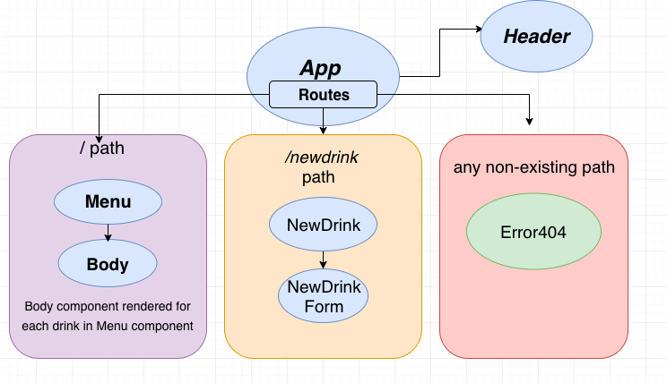

# Tap Room React

#### By _Regina Nurieva, 11.16.2018_

## Description

A site that displays drinks at the bar.

**Component Structure:**


### The Major Differences Between React and Angular:

1. Angular allows two-way data binding while React allows one-way data binding.

2. Angular uses the browser's DOM, while React uses a virtual DOM.

3. Angularis a JS framework by nature, but is built to use TypeScript. React, on the other hand, is a JavaScript library as well, but recommends using JSX.

4. This will differ from individual to individual based on skill and experience. On average, TypeScript is considered harder to learn than JSX, in turn increasing the learning curve with Angular as compared to React.

5. Angular is a fully-featured MVC framework. React is just more of a 'V' in the MVC.


## Specs week I

1. Separate application into components.

2. Create basic structure of application.

3. Add routing to the application.

## Development server

Run `npm run start` for a dev server. Navigate to `http://localhost:8080/`. The app will automatically reload if you change any of the source files.

## Setup/Installation Requirements

* Clone this repository from https://github.com/reginanurieva/Tap_Room_React.git

* Open up in the console with the following command:
```
cd Tap_Room_React
```
* Install node:
```
npm install
```
* Run the program in the browser:
```
npm run start
```

## Further help

To learn React, check out the [React documentation](https://reactjs.org/).

### License

*This software is licensed under the MIT license.*

Copyright (c) 2018 **Regina Nurieva**